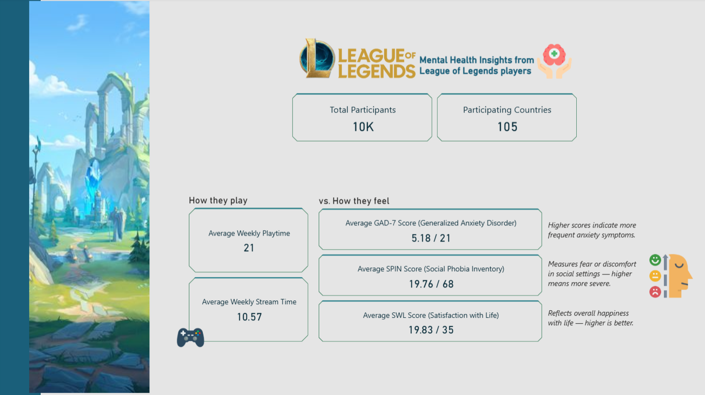
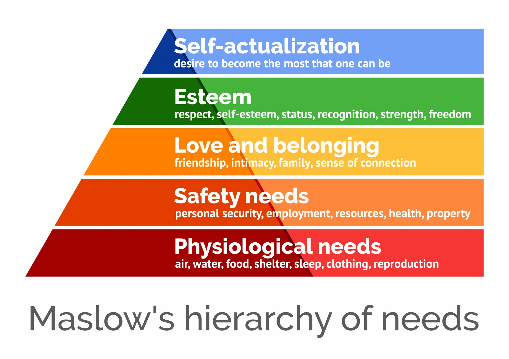
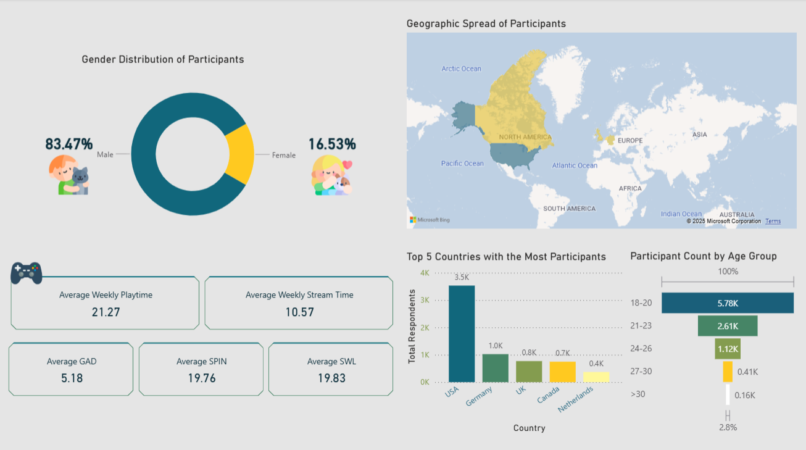
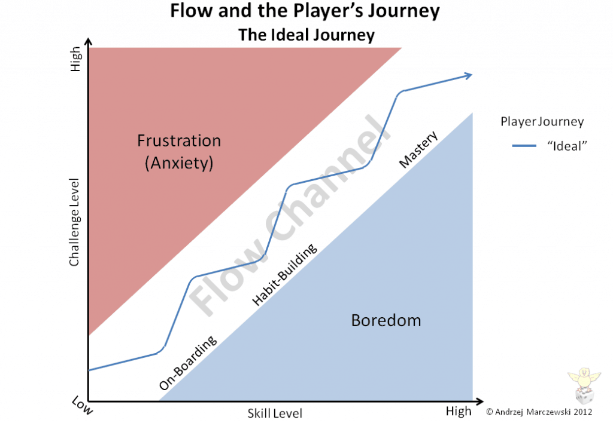

# Gaming as a Mirror of Mental Health - Insights from a 13,000-Player study

*Games are made for enjoyment, but play styles can sometimes signal underlying psychological stress*.
## 📊 Dataset overview
**Source:** [Online Gaming Anxiety Data](https://www.kaggle.com/datasets/divyansh22/online-gaming-anxiety-data).  
**Cohort size & reach:** **13,000** participants across **109** countries.   
**Survey domains:**
- **Demographics:** Segment players by life context to examine how social environments shape gaming behavior and mental health.
- **Gaming habits and behaviors:** Record leisure patterns, analyze play motivations, and link gaming behavior to mental health outcomes.
- **Mental health scoring:** Administered a battery of internationally validated, high-reliability psychometric scales:
    - **GAD-7 (Generalized Anxiety Disorder)**: a 7-item self-report screener quantifying generalized-anxiety severity over the past two weeks; extensively validated for clinical and research use [1].
	- **SPIN (Social Phobia Inventory**: a 17-item self-report measure of social anxiety capturing fear, avoidance, and physiological arousal in social/performance contexts; validated for screening and outcome tracking [2]. 
	- **SWLS (Satisfaction With Life Scale)**: a 5-item instrument assessing global cognitive judgments of life satisfaction with strong reliability and favorable psychometrics [3].
    - **SINS:** Single-item measure of self-love/narcissism.

Bottom line: **Games don’t cause mental crises, they amplify and reveal what’s already there.**
  Big question: Can we early-diagnose via gameplay patterns?

## 1) 🤔 Personal note: Why this topic? 
In modern society, as life grows increasingly stressful and human connections become fragile, leisure behaviors, like listening to music, browsing social media, or playing games, become an exceptionally accurate mirror of the inner self.  

> We can learn a great deal about someone simply by observing: what music they listen to, what they like on Facebook, as well as what games they play, how they play, and why they play.

Beyond killing time, gaming functions as a psychological ecosystem aligned with Maslow’s hierarchy of needs: (1) physiological, (2) safety, (3) belonging, (4) esteem, and (5) self-actualization [4]..

 
- **Self-Actualization:** When people play to create, express themselves, or compete at a high level (pro player, streamer, leader…). Here, the game is a tool to demonstrate ability, achieve personal milestones, and seek recognition from the community.
- **Esteem Needs:** When players want praise, recognized scores, titles, and leaderboard positions. Games provide a sense of self-respect, acknowledgment, and contribute to personal self-esteem.
- **Belonging and Love Needs:** When playing to connect with friends, join guilds, teammates, or Discord groups. Games help players feel part of a community, maintain friendships, or find companionship.
- **Safety Needs:** When playing to relieve stress, avoid risks, or seek a sense of control. Games act as a “safe zone” that temporarily helps players regulate their mood and avoid real-world insecurity. Players may bypass physiological needs, even safety needs, to pursue belonging and recognition. But when the lower tiers are unstable, they are prone to mental collapse if higher tiers are shaken (e.g., losing an account, dropping rank, being disliked by friends…).  
- **Physiological Needs:** Games do not directly satisfy basic physiological needs such as eating, sleeping, and breathing. On the contrary, excessive play can threaten this tier (e.g., skipping meals, losing sleep).

Therefore, I believe games are not the major cause of mental crises. Games are where those crises are visibly revealed. And I pose a major question in this research: 

> Is it possible to **early diagnose** a person’s mental health issues purely through the way they play games? 

Used correctly, games can relieve stress, help young people connect with their communities, and even become part of psychotherapy. But if used improperly, with dependency and without clear purpose, players themselves can turn games into a risk to their own mental well-being.
## 2) Demographics
The dataset comprises **13,000 participants** across **109 countries**, providing a large and diverse international cohort.

- **Age distribution:** More than **70% of participants were under 24 years old**, reflecting the dominant age group in the global gaming community. This demographic is also psychologically vulnerable, navigating transitions in education, career, and relationships, which are factors that often intersect with mental health outcomes.
- **Gender distribution:** The sample was **male-dominated (83.47%)**, with **females comprising 16.53%**. This imbalance mirrors the reality of highly competitive gaming communities such as _League of Legends_, where female participation remains limited [5]. The gender disparity is not trivial: prior research suggests that men and women may differ in how they experience and report anxiety, social avoidance, and life satisfaction, making it important to interpret results with gender context in mind [6].
- **Geographic diversity:** Participants came from **over 100 countries**, but representation skewed toward developed nations with strong eSports communities (e.g., North America, Western Europe) [7]. The U.S. constituted a large proportion of respondents, likely due to survey dissemination via **Reddit**.
- **Socioeconomic and occupational background:** While not uniformly captured across all respondents, subgroup analysis indicated differences between **students, employed participants, and unemployed participants**. Students tended to report healthier play patterns (more social, flexible, and fun-driven), whereas employed or unemployed respondents often reported stress-driven or avoidant gaming motivations.

These demographic characteristics frame how gaming behavior intersects with mental health. For instance, younger players may rely more heavily on games as a social outlet, while gender imbalance highlights potential issues of inclusion and psychological safety in gaming environments. The global reach of the dataset also strengthens its external validity, though cultural differences must be considered when interpreting psychological scales.
## 3) Time investment 
On average, players spent **21 hours per week** actively playing, which translates to about **3 hours per day**. This aligns almost exactly with the **180 minutes/day caution threshold** frequently cited by publishers and health experts as the point where gaming may begin to disrupt circadian rhythms, sleep quality, or academic/work performance.

Beyond playing, participants also devoted an additional **10.57 hours per week** (≈ **1.5 hours/day**) to _following_ the game: watching Twitch or YouTube streams, Facebook Gaming, professional tournaments, replays, strategy breakdowns, or highlight compilations. This suggests that for many, gaming is **no longer a short-term pastime**. It has become a **daily routine** integrated into leisure schedules in much the same way as music, television, or sports.
## 4) Scales 

| **Scale** | **Range** | **Interpretive Bands** | **Observed Mean** |
|-----------|-----------|-------------------------|------------------|
| **GAD-7** | 0–21 | 0–4: Normal (no significant anxiety) 5–9: Mild anxiety 10–14: Moderate anxiety ≥15: Severe anxiety | **5.18** |
| **SPIN**  | 0–68 | <20: No social anxiety 21–30: Mild 31–40: Moderate 41–50: Severe >50: Very severe | **19.76** |
| **SWLS**  | 5–35 | Higher scores indicate greater life satisfaction | **19.83** |

On the whole, mental health scores for gamers tend to fall in the **normal or mild range**. This challenges the common stereotype that gaming automatically leads to serious psychological problems. Instead, the evidence suggests that gaming doesn’t _cause_ mental health issues so much as it _reflects_ existing emotional and social struggles.

What’s particularly interesting is that even when levels of anxiety and social avoidance are low, **overall life satisfaction remains only average**. This points to an important truth: gaming can be a meaningful outlet, but it cannot replace the deeper foundations of well-being, such as family support, academic or career progress, and fulfilling offline relationships.

At the same time, looking only at the averages can be misleading. When we zoom in, certain groups show **higher risks**. For instance, players who mainly use games as a form of “relaxation” often report higher anxiety (GAD), lower life satisfaction (SWLS), and borderline levels of social avoidance (SPIN). These subgroups remind us that while the general picture looks moderate, there are vulnerable minorities within the data who experience gaming very differently.
## 6) Takeaways by variables
### 6.1. Motivation > Hours

  
  
  

In this dataset, player motivation is classified into **four primary categories**, each reflecting a distinct psychological orientation toward gaming:
- **(1) (2) Improve/Win**: Players driven by competition and mastery are the most likely to exceed the 180-minute daily threshold. For them, progress and victory outweigh concerns about time investment.
- **(3) Fun**: Those who play mainly for enjoyment and stimulation average about 19 hours per week. They report low anxiety (GAD), low social avoidance (SPIN), and solid life satisfaction (SWLS). In other words, they maintain good control and use gaming as a healthy, energizing pastime.
- **(4) Relax**: This is the smallest group, spending the least time (about 18 hours per week) but showing the highest anxiety, the second-highest social avoidance, and the second-lowest life satisfaction.

Two groups that are often confused are those who play for fun and those who play for **relaxation**. Psychologically, however, they represent **two very different worlds**.

**Fun** players engage with games for enjoyment, excitement, and positive stimulation — but they also want a certain level of challenge. Fun does not mean easy. In fact, when a game becomes too easy, these players quickly lose interest [8]. 

  
   
  <em>Enjoyment occurs when game challenge matches player expertise. Too much challenge leads to frustration, while too little leads to boredom. Only in the balance between skill and challenge do players sustain engagement and positive experience.
</em>

**Relax** players, on the other hand, enter games with a very different purpose: to escape pressure and find peace of mind. They do not focus on winning or losing; their goal is simply to rest. Paradoxically, although this group has the **lowest playtime** (about **18 hours per week**), they display the **highest GAD**, the **second-highest SPIN**, and the **second-lowest SWLS**. This suggests that many of these players are already genuinely exhausted or stressed, and are using games as a temporary refuge rather than a positive activity. The underlying problems (anxiety, fatigue, or social isolation) remain unresolved, even if playtime is modest. Research shows that escapist motivations in gaming are linked to poorer mental health outcomes compared to mastery, or social-driven play [9].

The paradox becomes sharper when considering their game of choice. Many “Relax” players turn to _League of Legends_ - a title known for **high pressure, toxic environments, demanding reflexes, and intense teamwork**. These factors often make it unsuitable for genuine relaxation and may actually **intensify stress** instead of alleviating it [10]. Not all games are equal when it comes to mental health benefits, and a mismatch between _motivation_ and _game type_ can inadvertently pull players deeper into stress.

The lesson here? It’s not simply the **amount of time** spent playing that predicts mental health outcomes. Rather, it is the **motivation behind play** that reveals the deeper emotional and psychological state of the player.

### 6.2. Occupation/Context
Player motivations and outcomes are also shaped by **social and occupational context**. The same game can serve very different psychological functions depending on whether someone is a student, employed, or unemployed.
#### Students
Students typically show the healthiest gaming patterns. With flexible schedules, lighter financial pressure, and strong peer networks, they play mainly for fun, not escape. Gaming blends into their social life through LAN parties, Discord chats, campus friendships, serving as a complement to school and relationships rather than a replacement.
#### Employed
For working adults, gaming often becomes stress relief under pressure. Job demands, deadlines, and office politics spill into their play. Limited free time means shorter but more emotionally charged sessions. Here, gaming acts as a pressure valve: effective in the moment, but prone to backfire when competitive titles add frustration instead of easing it. The benefit is fleeting rather than restorative.
#### Unemployed
For the unemployed, gaming frequently fills structural voids left by the absence of work or school. Without routine or social identity, games provide purpose, community, and achievement. This group is most vulnerable to over-reliance: even without extreme playtime, dependence is strong. Gaming becomes a coping mechanism that masks deeper issues of instability, isolation, and diminished self-worth rather than resolving them.
### 6.3. Gender 
One of the most striking aspects of this dataset is the gender disparity within the sample. The community is overwhelmingly male, reflecting the broader demographic reality of highly competitive titles like _League of Legends_. Yet within this imbalance, the data reveal meaningful differences in how men and women experience gaming and its relationship to mental health.

For male players, the trends are relatively consistent: they report lower levels of GAD and lower levels of SPIN. These indicators translate into a generally higher SWLS. Put differently, the gaming environment, dominated numerically by men, appears to be less psychologically taxing for them. In these spaces, men often feel freer to express themselves, compete, and connect without the same level of social tension or vulnerability that female players report.

By contrast, female players show a more complex profile. On average, they report higher anxiety and greater social avoidance. However, the data also reveal an important subgroup of women who present with low GAD but high SPIN. These players are not internally anxious, yet they remain reluctant to socialize within the gaming environment. This paradox reflects the broader social dynamics of male-heavy gaming spaces. Women may avoid voice chat or public communication not because of inner fear, but because of the external pressures of gendered expectations, subtle harassment, or the need to protect their image in communities that can feel hostile or dismissive of female voices [5, 6, 11]. It is less a matter of individual anxiety, and more a reaction to an environment that is not perceived as equally safe or inclusive.
### 7.4. Ranking
Player rank is more than just a badge of skill. It also shapes and reflects a player’s psychological state. The dataset suggests that different tiers correspond to distinct emotional landscapes, with mental health indicators rising or falling depending on the pressures tied to performance.

At the **Bronze** level, players are driven by a strong **desire to win**, yet they often lack the technical mastery or coordination needed to consistently achieve victory. This mismatch between ambition and ability produces a cycle of **frustration and perceived loss of control**. The data show higher levels of GAD and SPIN in this group, alongside lower SWLS. For many Bronze players, repeated defeat fosters self-doubt and reluctance to engage with teammates, creating a psychological environment marked by tension and withdrawal.

**Master** players is a rare group representing roughly 0.5% of the sample. However, they occupy an unusual psychological space. They report elevated anxiety, reflecting the pressure of sustained high-level performance, but show low social avoidance. Their elevated in-game status grants them a sense of agency and authority, allowing them to speak confidently in team settings. For these players, mastery of the game provides a buffer against social fear, even as the pressure to maintain their edge contributes to internal stress.

The **Challenger** tier, comprising only about **0.05% of players**, exemplifies the paradox of success. These top competitors do not display significant social avoidance, but they carry heavy **anxiety loads** and experience **reduced life satisfaction**. The explanation lies in the unique burden of prestige: once at the peak, every match is shadowed by the risk of decline. Maintaining status becomes as stressful as achieving it, leaving players caught in a cycle of vigilance and performance-related worry.

Interestingly, within high ranks, there is a subset of players who score highly on SWLS while also registering elevated **narcissism (SINS)**. For these individuals, satisfaction seems to stem less from inner well-being and more from **comparisons and external recognition** such as “I am better than others,” “I carry the team,” or “The community respects my skill.” While this fuels a strong sense of accomplishment, it also raises questions about the fragility of such satisfaction, which is built on achievement and visibility rather than inner balance.

## 9) Practical Implications
The results of this study carry practical lessons for different groups who interact with gaming: the players themselves, the families and institutions that surround them, and the professionals who design or monitor gaming environments.
#### For Players
Gamers should reflect on **why** they play, not just how much. A key recommendation is to match game type to motivation: if the goal is relaxation, then low-toxicity and low-pressure titles are better suited than competitive, high-stakes environments like _League of Legends_. Maintaining time hygiene is also essential: crossing the 180-minute daily threshold can interfere with sleep, mood, and productivity, so players should build awareness of how much time is being invested. Beyond the game, it is important to reconnect offline by nurturing relationships, life goals, and hobbies outside of virtual spaces. Finally, players should watch for self-alerts: rising anxiety, sleep disturbance, withdrawal from social interaction, or irritability when leaving the game are all warning signs that motivation has shifted in unhealthy ways.
#### For Parents and Schools
For educators and families, the focus should not be on policing hours alone. Asking **“why do you play?”** is more revealing than counting minutes. A student who plays for fun with friends may be socially thriving, whereas a student who plays to avoid stress or loneliness may be signaling deeper issues. By paying attention to the **context of play**, parents and teachers can distinguish between healthy recreation and early indicators of psychological strain.
#### For Publishers and Therapists
Game developers and mental health professionals can both act as gatekeepers of well-being. Publishers have access to vast telemetry data that could serve as early warning signals for problematic use. For therapists, these behavioral cues can also serve as valuable entry points for conversations with patients: how someone plays, and not just how long, may be one of the clearest mirrors of their emotional state.
## References 
[1] R. L. Spitzer, K. Kroenke, J. B. W. Williams, and B. Löwe, “A brief measure for assessing generalized anxiety disorder: the GAD-7,” _Arch. Intern. Med._, vol. 166, no. 10, pp. 1092–1097, 2006. [JAMA Network](https://jamanetwork.com/journals/jamainternalmedicine/fullarticle/410326)   
[2] K. M. Connor, J. R. T. Davidson, L. E. Churchill, A. Sherwood, E. Foa, and R. H. Weisler, “Psychometric properties of the Social Phobia Inventory (SPIN): New self-rating scale,” _Br. J. Psychiatry_, vol. 176, pp. 379–386, 2000. [Cambridge University Press & Assessment](https://www.cambridge.org/core/services/aop-cambridge-core/content/view/9E4A3EE20D2B1A6C222CDB5807AC086A/S0007125000264830a.pdf/psychometric-properties-of-the-social-phobia-inventory-spin-new-self-rating-scale.pdf)    
[3] E. Diener, R. A. Emmons, R. J. Larsen, and S. Griffin, “The Satisfaction With Life Scale,” _J. Pers. Assess._, vol. 49, no. 1, pp. 71–75, 1985. [Psychology Department Labs](https://labs.psychology.illinois.edu/~ediener/Documents/Diener-Emmons-Larsen-Griffin_1985.pdf)   
[4] A. H. Maslow, _Motivation and Personality_, 3rd ed. New York, NY, USA: Harper & Row, 1987. [books.google.com](https://books.google.com/books/about/Motivation_and_personality.html?id=L7_uAAAAMAAJ)   
[5] R. A. Ratan, N. Taylor, J. Hogan, T. L. M. Hogan, and D. Williams, “Stand by Your Man: An Examination of Gender Disparity in League of Legends,” _Games and Culture_, vol. 10, no. 5, pp. 379–397, 2015. [researchgate.net](https://www.researchgate.net/publication/275656456_Stand_by_Your_Man_An_Examination_of_Gender_Disparity_in_League_of_Legends)   
[6] C. P. McLean, _et al._, “Gender Differences in Anxiety Disorders: Prevalence, Persistence, and Comorbidity,” _J. Psychiatr. Res._, vol. 45, no. 8, pp. 1027–1035, 2011. [pmc.ncbi.nlm.nih.gov](https://pmc.ncbi.nlm.nih.gov/articles/PMC3135672/)   
[7] The Top 20 Best Esports Countries. [esports-betting.pro](https://www.esports-betting.pro/esports-countries/)
[8] A. Marczewski, “Flow, Player Journey and Employee Satisfaction”, Nov. 30, 2012. [Gamified.uk](https://www.gamified.uk/2012/11/30/flow-and-satisfaction/)   
[9] J. Billieux, D. Flayelle, A. R. Rumpf, and H. K. Stein, “High involvement versus pathological involvement in video games: A crucial distinction for ensuring accurate diagnosis and treatment,” _J. Behav. Addict._, vol. 4, no. 4, pp. 281–283, 2015. [link.springer.com/](https://doi.org/10.1007/s40429-019-00259-x)   
[10] J. Kowert, R. Festl, and T. Quandt, “Unpopular, overweight, and socially inept: Reconsidering the stereotype of online gamers,” _Cyberpsychol. Behav. Soc. Netw._, vol. 17, no. 3, pp. 141–146, 2014. [liebertpub](https://doi.org/10.1089/cyber.2013.0118)   
[11] A. Fox and J. Tang, “Women’s experiences with general and sexual harassment in online video games: Rumination, organizational responsiveness, withdrawal, and coping strategies,” _New Media & Society_, vol. 19, no. 8, pp. 1290–1307, 2017. [researchgate.net](https://www.researchgate.net/publication/297485534_Women's_experiences_with_general_and_sexual_harassment_in_online_video_games_Rumination_organizational_responsiveness_withdrawal_and_coping_strategies)